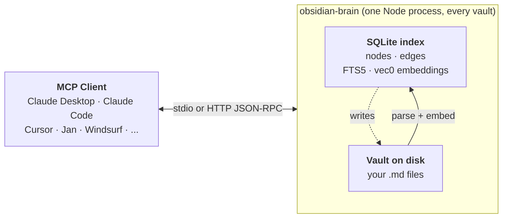

# obsidian-brain

[](https://www.npmjs.com/package/obsidian-brain)
[](https://opensource.org/licenses/Apache-2.0)
[](package.json)
[](https://github.com/sweir1/obsidian-brain)

A standalone Node MCP server that gives Claude (and any other MCP client) **semantic search + knowledge graph + vault editing** over your Obsidian vaults. One process serves one or more vaults, over stdio for a local client or over HTTP for a remote one. No plugin, no API key, nothing hosted. Your vault content never leaves your machine.

> [!NOTE]
> This is [Marts's fork](https://github.com/martijnarts/obsidian-brain) of [sweir1/obsidian-brain](https://github.com/sweir1/obsidian-brain). It adds several vaults per server, an HTTP transport, idle model unloading and 26 more tools. The fork is not published on npm: `npx obsidian-brain` installs the upstream release without these changes. Build the fork from source instead, as [Development](docs/development.md) describes.

> 📖 **Full docs → [sweir1.github.io/obsidian-brain](https://sweir1.github.io/obsidian-brain/)**

**Contents** — [Why](#why-obsidian-brain) · [Quick start](#quick-start) · [What you get](#what-you-get) · [How it works](#how-it-works) · [Troubleshooting](#troubleshooting) · [Recent releases](#recent-releases)

## Why obsidian-brain?

- **Works without Obsidian running** — unlike Local REST API-based servers, obsidian-brain reads `.md` files directly from disk. Obsidian can be closed; your vault is just a folder.
- **No Local REST API plugin required** — nothing to install inside Obsidian.
- **Several vaults, one server** — `--vault personal=… --vault work=…`; every tool takes a `vault` argument, and each vault keeps its own index and graph.
- **Local or remote** — stdio for a client that spawns the server, or `--transport http` for a long-running server behind an authenticating proxy.
- **Light when idle** — one embedding model shared by every vault, unloaded after an idle period and loaded again on the next search.
- **Chunk-level semantic search with RRF hybrid retrieval** — embeddings at markdown-heading granularity, fused with FTS5 BM25 via Reciprocal Rank Fusion. Finds the exact chunk, ranks on meaning.
- **The only Obsidian MCP server with PageRank + Louvain + graph analytics** — ask for your vault's most influential notes, bridging notes, theme clusters. Nobody else ships this.
- **Ollama provider for high-quality local embeddings** — switch to `qwen3-embedding:0.6b`, `nomic-embed-text`, `bge-m3`, etc. with one env var.
- **All in one `npx` install** — no clone, no build, no API key, no hosted endpoint. Vault content never leaves your machine.

## Quick start

### One-line install (macOS + Claude Desktop)

```bash
/bin/bash -c "$(curl -fsSL https://raw.githubusercontent.com/sweir1/obsidian-brain/main/scripts/install.sh)"
```

Installs Homebrew + Node 22.12+ if you don't already have them, adds the `/usr/local/bin` symlinks that Claude Desktop needs, merges obsidian-brain into your `claude_desktop_config.json`, opens the Full Disk Access pane for you to toggle Claude on, and relaunches Claude. You'll be asked for your macOS password once (for Homebrew + the symlinks) and your vault path once. Everything else is automatic. Audit what it does: [`scripts/install.sh`](scripts/install.sh).

### Manual install

Requires Node 22.12+ and an Obsidian vault (or any folder of `.md` files — Obsidian itself is optional).

Wire obsidian-brain into your MCP client. Example for **Claude Desktop** (`~/Library/Application Support/Claude/claude_desktop_config.json`):

```json
{
  "mcpServers": {
    "obsidian-brain": {
      "command": "npx",
      "args": ["-y", "obsidian-brain@latest", "server", "--vault", "notes=/absolute/path/to/your/vault"]
    }
  }
}
```

Quit Claude Desktop (⌘Q on macOS) and relaunch. That's it.

> [!NOTE]
> On first boot the server auto-indexes your vault and downloads a ~34 MB embedding model. Tools may take 30–60 s to appear in the client. Subsequent boots are instant.

> [!TIP]
> **Not a developer?** The [macOS walkthrough](docs/install-mac-nontechnical.md) covers Homebrew, Node, the GUI-app PATH fix, and Full Disk Access step-by-step.

**For every other MCP client** (Claude Code, Cursor, VS Code, Jan, Windsurf, Cline, Zed, LM Studio, JetBrains AI, Opencode, Codex CLI, Gemini CLI, Warp): see [Install in your MCP client](docs/install-clients.md).

→ Full env-var reference: [Configuration](docs/configuration.md)
→ Model / preset / Ollama details: [Embedding model](docs/embeddings.md)
→ Migrating from aaronsb's plugin: [Migration guide](docs/migration-aaronsb.md)

## What you get

42 MCP tools grouped by intent. Every tool except `list_vaults` takes a `vault` argument naming one of the vaults you configured:

- **Vaults** — `list_vaults`
- **Find** — `search`, `list_notes`, `read_note`, `find_notes_by_name`, `grep_vault`, `query_notes`
- **Files** — `read_notes`, `read_note_part`, `file_info`, `create_folder`, `delete_folder`, `list_attachments`, `create_attachment`
- **Write** — `create_note`, `create_note_from_template`, `edit_note`, `apply_edit_preview`, `link_notes`, `move_note`, `delete_note`
- **Properties** — `list_property_values`, `update_properties`
- **Structure** — `vault_overview`, `list_tags`, `list_bookmarks`
- **Tasks and blocks** — `list_tasks`, `set_task_status`, `ensure_block_id`
- **Canvas** — `read_canvas`, `edit_canvas`
- **Map the graph** — `find_connections`, `find_path_between`, `detect_themes`, `rank_notes`
- **Maintenance** — `reindex`, `index_status`, `find_broken_links`, `find_orphaned_notes`, `search_and_replace`, `rename_tag`, `rename_heading`

→ Arguments, examples, and response shapes: [Tool reference](docs/tools.md)

## How it works



Each vault has its own SQLite index, graph and file watcher; the embedding model is shared. Retrieval and writes both go through the index: reads are microsecond-cheap, writes land on disk immediately and incrementally re-index the affected file. Embeddings are chunk-level (heading-aware recursive chunker preserving code + LaTeX blocks), and `search`'s default `hybrid` mode fuses chunk-level semantic rank with FTS5 BM25 via Reciprocal Rank Fusion.

→ Deeper write-up — why stdio, several vaults in one server, why SQLite, why local embeddings: [Architecture](docs/architecture.md)
→ Flags for vaults, transport and listen address: [CLI](docs/cli.md#obsidian-brain-server-options)
→ Live watcher behaviour + debounces: [Live updates](docs/watching.md)
→ Scheduled reindex (macOS launchd / Linux systemd): [Scheduled indexing (macOS)](docs/launchd.md) · [(Linux)](docs/systemd.md)

## Troubleshooting

Four most common:

- **"Connector has no tools available"** in Claude Desktop — usually the server crashed at startup. Check `~/Library/Logs/Claude/mcp-server-obsidian-brain.log`. Fix: `npm install -g obsidian-brain@latest`, quit Claude (⌘Q), relaunch.
- **`ERR_DLOPEN_FAILED` / `NODE_MODULE_VERSION` mismatch** — `better-sqlite3` built against a different Node ABI. Fix: `PATH=/opt/homebrew/bin:$PATH npm rebuild -g better-sqlite3`.
- **`Give at least one vault with --vault <name=path>.`** — the server got no `--vault` flag. Add `"--vault", "notes=/absolute/path/to/your/vault"` to the `args` of your client config.
- **Old version loading via `npx`** (your client still shows the previous release after a publish) — stale npx cache. Fix: `rm -rf ~/.npm/_npx`, then restart your client. Keeping `@latest` in your config prevents this.

→ Full troubleshooting guide (watcher not firing, stale index, running multiple clients, timeouts, embedding-dim mismatch, log locations): [docs/troubleshooting.md](docs/troubleshooting.md)

## Recent releases

<!-- GENERATED:recent-releases — auto-pulled from docs/CHANGELOG.md by scripts/gen-readme-recent.mjs. Edit CHANGELOG.md, then run `npm run gen-readme-recent`. -->
- **v1.7.24** (2026-05-16) — embeddings.md BYOM callout + 5 devDep bumps
- **v1.7.23** (2026-05-16) — BYOM Ollama auto-pull gate + logger sweep + SIGTERM unit test
- **v1.7.22** (2026-05-15) — structured stderr (NDJSON) + Ollama preparing-state + dependabot security bumps + SIGTERM drain integration test
- **v1.7.21** (2026-04-27) — install.sh vault-picker fix + auto `ollama pull` + docs/test polish
- **v1.7.20** (2026-04-27) — Ollama prefix-lookup bug + 13 audit polish items
<!-- /GENERATED:recent-releases -->

→ Full changelog: [docs/CHANGELOG.md](docs/CHANGELOG.md) · Forward plan: [docs/roadmap.md](docs/roadmap.md) · Build from source: [docs/development.md](docs/development.md)

## Credits

Thanks to [`obra/knowledge-graph`](https://github.com/obra/knowledge-graph) and [`aaronsb/obsidian-mcp-plugin`](https://github.com/aaronsb/obsidian-mcp-plugin) for the ideas and code this project draws on. Also [Xenova/transformers.js](https://github.com/xenova/transformers.js) (local embeddings), [graphology](https://graphology.github.io/) (graph analytics), and [sqlite-vec](https://github.com/asg017/sqlite-vec) (vector search in SQLite).

## Related projects

- [`apple-notes-brain`](https://github.com/sweir1/apple-notes-brain) — sibling
  MCP server for Apple Notes on macOS: read, write, and search with full
  Markdown round-trip in both directions.

## License

[Apache License 2.0](./LICENSE) — Copyright 2026 sweir1.
